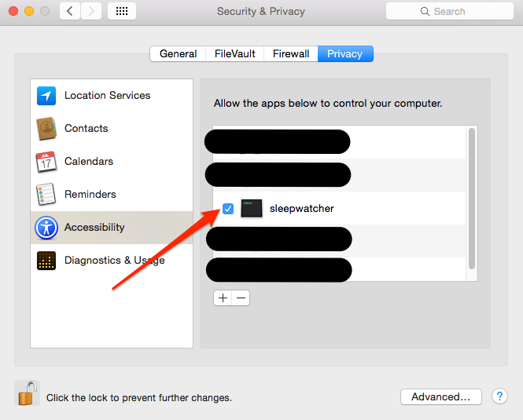

sleepwatcher-lync-status
=====================

Version: 0.0.2

Automatically changes the Microsoft Lync status when the screen is locked or unlocked on Mac OS X.
Lync does not automatically do this, which causes issues when your screen is locked, but your contacts still
see you as available.

Tested on Mac OS X 10.10.1 and Microsoft Lync 2011 (14.0.10).

The provided default configuration does the following:

* When your screen is locked (and/or goes to sleep), it stores your current Lync status and then sets it to _Appear Away_.
* When your screen is unlocked (or wakes up from sleep), it restores your Lync status to your previous status.

Please note that this only works if you set your system to put your screen to sleep when the system is locked. I use the `Ctrl+Shift+Eject` keyboard combo to lock the screen. Please open an issue here on Github if you are running into any problems with this.

The default actions can be changed by editing the `com.nilswinkler.sleepwatcher-lync-status-20compatibility-localuser.plist` file. Take a look at this file (and the `install.sh` script for more details).

## Installation

This tool uses [SleepWatcher](http://www.bernhard-baehr.de/) to be notified when the screen goes to sleep.
Since SleepWatcher is licensed under the GPL, it can't be bundled with this tool, you have to install it separately.
The easiest way to do this is through [Homebrew](https://brew.sh):

```bash
brew install sleepwatcher
```

If you don't use Homebrew, you can install SleepWatcher from its [homepage](http://www.bernhard-baehr.de/).

Once SleepWatcher is installed locally (ignore the steps printed by Homebrew), you need to clone this repository to a local directory on your Mac:

```bash
git clone https://github.com/nwinkler/sleepwatcher-lync-status.git
```

This will create a new directory with the contents of this repo. Change into this directory and install the provided default scripts:

```bash
cd sleepwatcher-lync-status

./install.sh
```

If you lock your screen now (for the first time after installing this tool), it will not work. After unlocking your screen, you will see a notification indicating that the `sleepwatcher` application wants to change your _assistive settings_. Open your Mac's _System Preferences_ and check the box in the _Security & Privacy > Accessability_ screen next to _sleepwatcher_. This is required to allow SleepWatcher to use the system's menu to change the Lync status:



You may have to provide an admin user or your password to change this setting.

### Uninstalling

To remove the sleepwatcher integration, simply call the provided uninstall script:

```bash
cd sleepwatcher-lync-status

./uninstall.sh
```

## To Do

* _N/A_

## Known Issues

* The menu integration can fail on installations of OS X that don't use English language. There are some hardcoded values in the code referencing the menu entries.

## Contributing

This project uses [Git-Flow](http://nvie.com/posts/a-successful-git-branching-model/), any changes or pull requests need to be made against the _develop_ branch.

## References

* [SleepWatcher](http://www.bernhard-baehr.de/)

## License
Copyright (c) 2014 Nils Winkler. Licensed under the MIT license.
